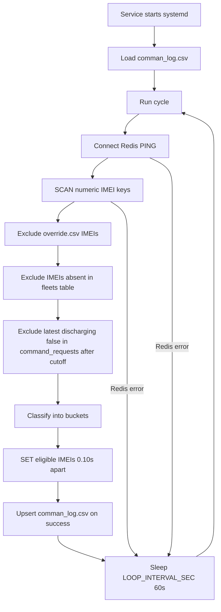
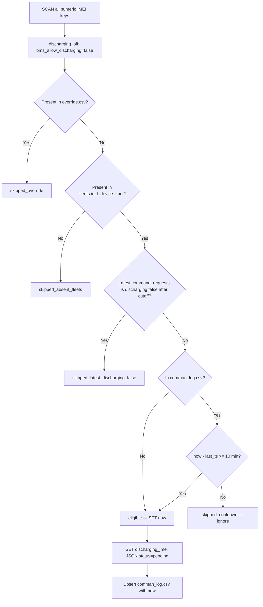
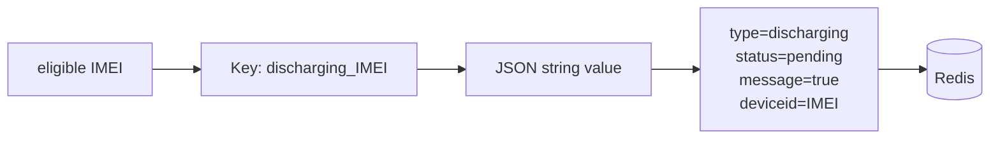
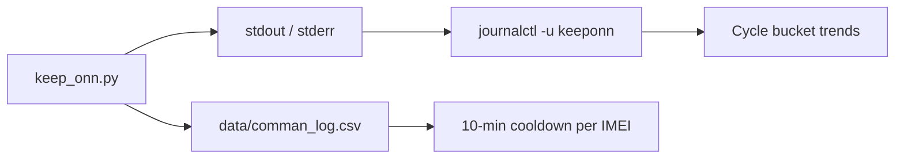

# keepONN — flow, buckets, deploy & logs

Standalone daemon that:
1) finds Redis IMEIs with `bms_allow_discharging=false`,
2) excludes IMEIs from `override.csv`,
3) excludes IMEIs absent in `fleets.io_t_device_imei`,
4) excludes IMEIs whose latest `command_requests` row is `discharging` + `command_status=false` after cutoff,
5) then applies cooldown via `comman_log.csv` and issues `SET discharging_<imei>` with `status=pending`.

---

## Daemon loop (every 60s)



---

## Per-cycle bucket logic

Each scanned `discharging_off` IMEI moves through ordered filters per cycle:



### Bucket definitions

| Bucket | Rule | Journal line |
|--------|------|--------------|
| **redis_discharging_off_total** | All IMEIs from Redis with `bms_allow_discharging=false` | `redis_discharging_off_total=N` |
| **skipped_soc_zero** | Above, but `numeric_io_data.soc == 0` (dropped immediately) | `skipped_soc_zero=N` |
| **after_soc_filter** | Above total minus SOC-zero; continues through override/fleets/command/cooldown | `after_soc_filter=N` |
| **skipped_override** | IMEI found in `override.csv` (`imei,reason`) | `skipped_override=N` |
| **skipped_absent_fleets** | IMEI not found in `fleets.io_t_device_imei` | `skipped_absent_fleets=N` |
| **skipped_latest_discharging_false** | Latest `command_requests` row per IMEI has `command='discharging'` and `command_status=false`, with `created_at > COMMAND_REQUEST_MIN_CREATED_AT` | `skipped_latest_discharging_false=N` |
| **eligible** | Passed all filters; not in cooldown CSV **or** last command ≥ 10 min ago | `eligible=N` |
| **skipped_cooldown** | Passed all filters but in CSV and last command < 10 min ago | `skipped_cooldown=N` |

Always:
`redis_discharging_off_total = skipped_soc_zero + after_soc_filter`

And:
`after_soc_filter = skipped_override + skipped_absent_fleets + skipped_latest_discharging_false + eligible + skipped_cooldown`

---

## Redis SET (command key)



**Example key:** `discharging_866738082082395`

**Example value:**
```json
{
  "device_type": "Teltonika-TFT100",
  "deviceid": "866738082082395",
  "message": "true",
  "platform": "heyev",
  "status": "pending",
  "timestamp": "2026-07-01T...Z",
  "type": "discharging",
  "updated_at": "2026-07-01T..."
}
```

> keepONN **reads** device state from numeric IMEI keys and **writes** command keys `discharging_<imei>`. It does not modify `bms_allow_discharging` directly.

---

## First-run wave pattern (why eligible spikes ~217/min)

```mermaid
gantt
    title First bulk SET vs 10-min cooldown
    dateFormat HH:mm
    axisFormat %H:%M

    section First cycle
    SET IMEIs 1-217     :a1, 03:12, 22s
    SET IMEIs 218-434   :a2, after a1, 22s
    SET IMEIs 435-767   :a3, after a2, 33s

    section Re-eligible waves
    Wave 1 ~217 eligible :b1, 03:22, 1m
    Wave 2 ~216 eligible :b2, 03:23, 1m
    Wave 3 ~217 eligible :b3, 03:25, 1m
```



After the first bulk pass fully ages out (~10 min), steady state is mostly small `eligible` counts (new off devices only).

---

## Deploy (Ubuntu EC2)

```bash
# Clone
git clone <keepONN-repo-url> keepONN-REPO
cd keepONN-REPO

# Optional: edit Redis creds (defaults work if same as keeponn.env.example)
cp keeponn.env.example keeponn.env
nano keeponn.env

# Optional: dry-run preview (foreground)
python3 -m venv .venv && .venv/bin/pip install -r requirements.txt
DRY_RUN=1 LOOP_INTERVAL_SEC=5 ./run.sh

# Install / update systemd service
sudo ./deploy.sh

# Remove service
sudo ./deploy.sh --remove

# After code updates
git pull && sudo ./deploy.sh
```

### Service paths

| Item | Path |
|------|------|
| Install dir | `~/keepONN-REPO/` |
| Env file | `~/keepONN-REPO/keeponn.env` |
| Override CSV | `~/keepONN-REPO/data/override.csv` |
| Cooldown CSV | `~/keepONN-REPO/data/comman_log.csv` |
| systemd unit | `/etc/systemd/system/keeponn.service` |

### Default tuning (`keeponn.env`)

| Variable | Default |
|----------|---------|
| `LOOP_INTERVAL_SEC` | 60 — pause between cycles |
| `COOLDOWN_MINUTES` | 10 — min gap before re-command same IMEI |
| `SET_INTERVAL_SEC` | 0.10 — gap between SETs within one cycle |
| `COMMAND_REQUEST_MIN_CREATED_AT` | `2026-06-30T18:29:59Z` — UTC cutoff for latest-command exclusion |

---

## Logs & monitoring

### 1. systemd journal (main runtime log)

No separate log file — output goes to journald.

```bash
# Live follow
sudo journalctl -u keeponn -f

# Last 50 lines
sudo journalctl -u keeponn -n 50

# Today only
sudo journalctl -u keeponn --since today

# Service health
sudo systemctl status keeponn
```

**Journal messages:**

| Message | Meaning |
|---------|---------|
| `keepONN starting — mode=LIVE` | Daemon started |
| `Cycle started at ...` | New scan cycle |
| `redis_discharging_off_total=..., skipped_soc_zero=..., after_soc_filter=..., skipped_override=..., skipped_absent_fleets=..., skipped_latest_discharging_false=..., eligible=..., skipped_cooldown=...` | Full bucket summary |
| `SET discharging_... at ...` | Successful Redis write |
| `Cycle finished ... set=N, failed=N` | Cycle complete |
| `Redis connection failed` | Will retry next cycle |
| `Postgres error` | DB connectivity/query issue, will retry next cycle |

### 2. Cycle trend from journal (no extra file)

```bash
# Bucket summaries + cycle summaries
sudo journalctl -u keeponn --no-pager | grep -E "redis_discharging_off_total=|Cycle finished"

# Export to text file
sudo journalctl -u keeponn --no-pager \
  | grep -E "Cycle started|redis_discharging_off_total=|Cycle finished" \
  > ~/keeponn-trend.txt
```

### 3. Command cooldown CSV (persistent)

```bash
# Row count (minus header ≈ commanded IMEIs tracked)
wc -l ~/keepONN-REPO/data/comman_log.csv

# Last commands
tail -10 ~/keepONN-REPO/data/comman_log.csv

# Live watch (updates after each cycle with SETs)
tail -f ~/keepONN-REPO/data/comman_log.csv
```

Format: `imei,timestamp` (IST) — one row per IMEI, updated on each successful SET.

### 4. Override CSV (manual exclusions)

```bash
# View template / entries
cat ~/keepONN-REPO/data/override.csv

# Expected columns
# imei,reason
```

### 5. Foreground debug (bypass systemd)

```bash
sudo systemctl stop keeponn
cd ~/keepONN-REPO
set -a && source keeponn.env && set +a
PYTHONUNBUFFERED=1 ./run.sh
# Ctrl+C to stop, then: sudo systemctl start keeponn
```

---

## Log sources summary



| Source | Path / command | What it records |
|--------|----------------|-----------------|
| Journal | `sudo journalctl -u keeponn -f` | All cycle logs, SET lines, errors |
| CSV | `data/comman_log.csv` | Last successful command time per IMEI |
| Env | `keeponn.env` | Config (not written by app) |
| systemd | `/etc/systemd/system/keeponn.service` | Service definition |
